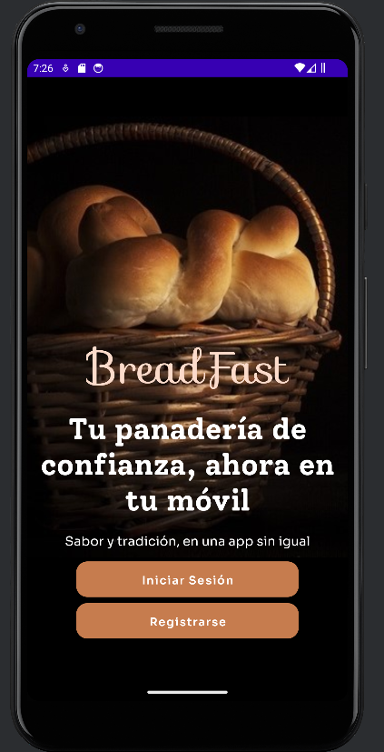

# Breadfast :bread:

Breadfast es una aplicación móvil diseñada para los clientes de una panadería, permitiendo a los usuarios registrarse, iniciar sesión y gestionar sus pedidos y puntos de fidelidad. Este proyecto fue desarrollado como parte de un trabajo universitario y está en una etapa de desarrollo inicial. Aunque se ha implementado la interfaz básica y los elementos de navegación, la aplicación no valida los datos ingresados ni tiene completa funcionalidad.

## Funcionalidades Implementadas :white_check_mark:

- **Pantalla de Inicio**: Muestra la imagen de la aplicación y ofrece dos botones: "Iniciar sesión" y "Registrarse".
- **Registro e Inicio de Sesión**: Permite a los usuarios registrarse como nuevos o iniciar sesión con una cuenta existente, aunque no realiza validación de datos.
- **Pantalla Principal**: Al ingresar, se muestra el nombre del usuario en la parte superior, un botón "Mis pedidos", una barra de búsqueda, una imagen con un botón "Mis puntos" y una lista de productos con sus imágenes y precios.
- **Mis Puntos**: Lleva a una pantalla donde se visualiza la cantidad de puntos acumulados, sin validación de datos.
- **Barra de Navegación**: Incluye una barra de navegación que actualmente no está funcional.

**Nota**: La aplicación permite la navegación entre pantallas y la interacción con algunos botones, pero no realiza validaciones de datos ni gestiona entradas incorrectas. Algunas funcionalidades planificadas están ausentes en esta versión.

## Estado del Proyecto :construction:

Este proyecto está en su etapa inicial y no es completamente funcional. Los botones y elementos de la interfaz están presentes y operativos en términos de navegación, pero no realizan validaciones de datos ni gestionan errores. La aplicación está diseñada para mostrar una vista preliminar del diseño y la estructura, y no se espera que funcione completamente en su estado actual.

- **Desarrollo**: Este proyecto fue desarrollado por mí, Estefano Quito Villanueva, como parte de un trabajo universitario. La implementación actual refleja el estado alcanzado al momento de presentar el proyecto (1 semana).

## Capturas de Pantalla :camera:

### Pantalla de Inicio

